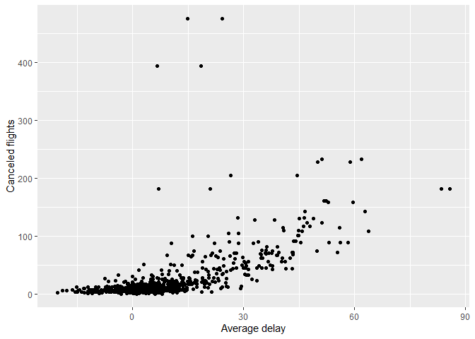

433 hw1
================
Bo Li
2022/9/26

## Q1

*How many flights have a missing dep\_time? What other variables are
missing? What might these rows represent?*

``` r
filter(flights,is.na(dep_time))
```

    ## # A tibble: 8,255 × 19
    ##     year month   day dep_time sched_de…¹ dep_d…² arr_t…³ sched…⁴ arr_d…⁵ carrier
    ##    <int> <int> <int>    <int>      <int>   <dbl>   <int>   <int>   <dbl> <chr>  
    ##  1  2013     1     1       NA       1630      NA      NA    1815      NA EV     
    ##  2  2013     1     1       NA       1935      NA      NA    2240      NA AA     
    ##  3  2013     1     1       NA       1500      NA      NA    1825      NA AA     
    ##  4  2013     1     1       NA        600      NA      NA     901      NA B6     
    ##  5  2013     1     2       NA       1540      NA      NA    1747      NA EV     
    ##  6  2013     1     2       NA       1620      NA      NA    1746      NA EV     
    ##  7  2013     1     2       NA       1355      NA      NA    1459      NA EV     
    ##  8  2013     1     2       NA       1420      NA      NA    1644      NA EV     
    ##  9  2013     1     2       NA       1321      NA      NA    1536      NA EV     
    ## 10  2013     1     2       NA       1545      NA      NA    1910      NA AA     
    ## # … with 8,245 more rows, 9 more variables: flight <int>, tailnum <chr>,
    ## #   origin <chr>, dest <chr>, air_time <dbl>, distance <dbl>, hour <dbl>,
    ## #   minute <dbl>, time_hour <dttm>, and abbreviated variable names
    ## #   ¹​sched_dep_time, ²​dep_delay, ³​arr_time, ⁴​sched_arr_time, ⁵​arr_delay

With 8255 missing dep\_time in the flight data frame.

dep\_delay, arr\_time, arr\_delay, and air\_time are also missing.

The flight may be canceled so those variables are NA.

## Q2

*Currently dep\_time and sched\_dep\_time are convenient to look at, but
hard to compute with because they’re not really continuous numbers.
Convert them to a more convenient representation of number of minutes
since midnight.*

``` r
# Original format = HHMM, so integer division by 100 to get hours and mod by 100 to get minutes.
# Mod by (24*60) to treat start as midnight
flights<- mutate(flights,
  dep_time = (dep_time %/% 100 * 60 + dep_time %% 100) %% (24*60),
  sched_dep_time = (sched_dep_time %/% 100 * 60 + sched_dep_time %% 100) %% (24*60)
)
flights
```

    ## # A tibble: 336,776 × 19
    ##     year month   day dep_time sched_de…¹ dep_d…² arr_t…³ sched…⁴ arr_d…⁵ carrier
    ##    <int> <int> <int>    <dbl>      <dbl>   <dbl>   <int>   <int>   <dbl> <chr>  
    ##  1  2013     1     1      317        315       2     830     819      11 UA     
    ##  2  2013     1     1      333        329       4     850     830      20 UA     
    ##  3  2013     1     1      342        340       2     923     850      33 AA     
    ##  4  2013     1     1      344        345      -1    1004    1022     -18 B6     
    ##  5  2013     1     1      354        360      -6     812     837     -25 DL     
    ##  6  2013     1     1      354        358      -4     740     728      12 UA     
    ##  7  2013     1     1      355        360      -5     913     854      19 B6     
    ##  8  2013     1     1      357        360      -3     709     723     -14 EV     
    ##  9  2013     1     1      357        360      -3     838     846      -8 B6     
    ## 10  2013     1     1      358        360      -2     753     745       8 AA     
    ## # … with 336,766 more rows, 9 more variables: flight <int>, tailnum <chr>,
    ## #   origin <chr>, dest <chr>, air_time <dbl>, distance <dbl>, hour <dbl>,
    ## #   minute <dbl>, time_hour <dttm>, and abbreviated variable names
    ## #   ¹​sched_dep_time, ²​dep_delay, ³​arr_time, ⁴​sched_arr_time, ⁵​arr_delay

## Q3

*Look at the number of canceled flights per day. Is there a pattern? Is
the proportion of canceled flights related to the average delay? Use
multiple dyplr operations, all on one line, concluding with
ggplot(aes(x= ,y=)) + geom\_point()*

``` r
flights %>%
  group_by(year,month,day) %>%
  summarise(canceled_per_day= sum(is.na(air_time)),
    mean_arr_delay = mean(arr_delay, na.rm = TRUE),
    mean_dep_delay = mean(dep_delay, na.rm = TRUE)) %>%
  ggplot(aes(y=canceled_per_day)) + 
  geom_point(aes(x=mean_arr_delay)) + 
  geom_point(aes(x=mean_dep_delay))+
  labs(x = "Average delay", y = "Canceled flights")
```

    ## `summarise()` has grouped output by 'year', 'month'. You can override using the
    ## `.groups` argument.

<!-- -->

There is a positive correlation between canceled flights and the average
delay. As increasing in average delays, the canceled flights also
increase.
